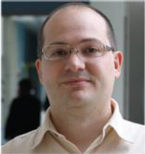
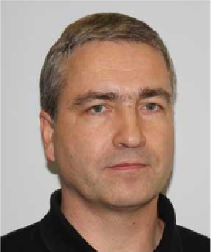

# Software libraries #

- [**SOQCS**](https://github.com/SOQCSAdmin/SOQCS ): Stochastic Optical Quantum Circuit Simulator is a Python and C++ library which offers a framework to define, simulate and study quantum linear optical circuits in presence of various imperfections typically encountered in experiments. 

- [**QoptKIT**](https://github.com/SOQCSAdmin/QoptKIT ): Optical circuits in Qiskit. Translate Qiskit circuits to quantum-optical circuits made of phase shifters and beamsplitters, simulate the circuit, then translate the outcome back to a qubit encoding. 

# Authorship #

|&nbsp; &nbsp; &nbsp; &nbsp; &nbsp; &nbsp; &nbsp; &nbsp; &nbsp;|
:----------------------------------:|:------------------------------------------------------------:|:--------------------------------:
<b>Javier Osca</b>                  |                                                              |Jiri Vala</b> 
e-mail: soqcslib@gmail.com          |                                                              |e-mail: jiri.vala@mu.ie
Maynooth University                 |                                                              |Maynooth University            

# Acknowledgements #

These software libraries were developed within the project QCoIr Quantum Computing in Ireland: A Software Platform for Multiple
Qubit Technologies No. DT 2019 0090B which has been supported by the Enterprise Ireland within the Disruptive Technologies
Innovation Fund programme.

